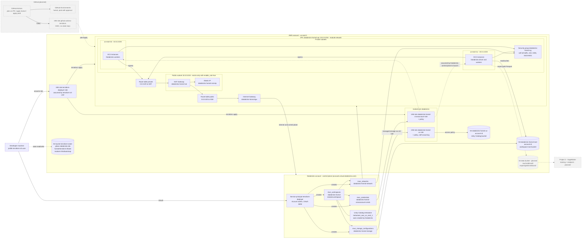
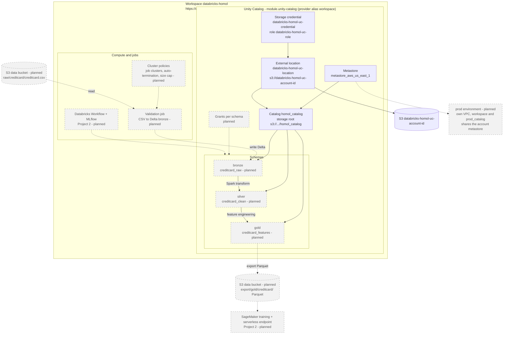
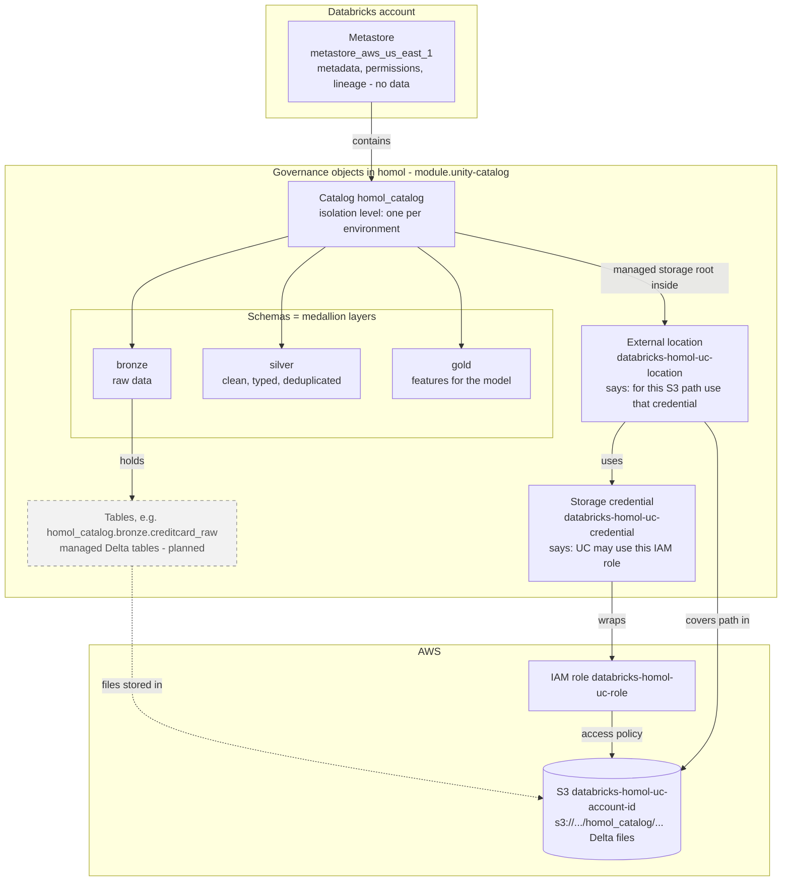
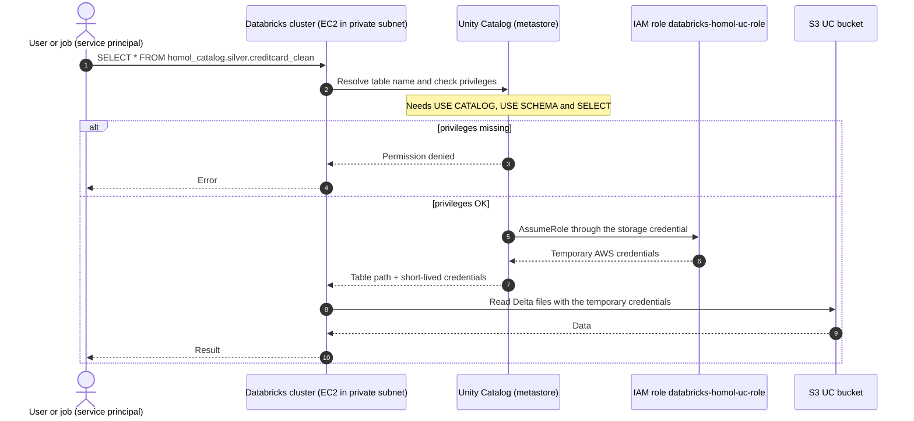
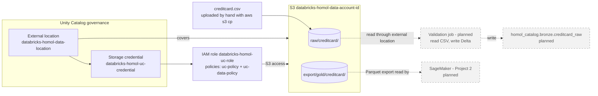

# databricks-aws-terraform-lab

Hands-on lab provisioning a Databricks workspace on AWS using Terraform, with CI/CD via GitHub Actions. Built to practice production-grade MLOps/data-platform requirements: Databricks on AWS, Delta Lake, Unity Catalog, and infrastructure as code with homologation/production environments.

## Project structure

```
infra/
  bootstrap/           # creates the S3 bucket for remote state — local state, applied once by hand
  modules/
    network/           # VPC, subnets, security groups
    iam-databricks/    # cross-account role, root bucket, Unity Catalog bucket/role
    workspace/         # Databricks workspace resources
    unity-catalog/     # storage credential, external location, catalogs, schemas
  environments/
    homol/
    prod/
.github/
  workflows/
```

## Architecture diagrams

Legend: solid = applied in `homol`; dashed grey = planned. Labels like `module.network` show which Terraform module owns each piece.

### Macro view: AWS, Databricks account and CI/CD



### Micro view: inside the Databricks workspace (Unity Catalog)



## 1. AWS IAM setup

This project uses a two-identity pattern: a low-privilege IAM user that can only assume a role, and a role that holds the actual permissions. The user never has direct access to AWS resources.

### 1.1 Create the IAM user

**User:** `terraform-cli-user`
No console access, no permissions attached directly — this user only gets the ability to assume a role (step 1.5).

### 1.2 Create the S3 bootstrap policy (attached to the role, not the user)

**Policy:** `terraform-bootstrap-s3-policy`

> Note: the action list below includes the read (`Get*`) actions required for the Terraform AWS provider to confirm resource state after creation. Missing any of these causes the provider to mark the resource as `tainted` after a partial failure.

```json
{
  "Version": "2012-10-17",
  "Statement": [
    {
      "Sid": "TerraformBootstrapS3",
      "Effect": "Allow",
      "Action": [
        "s3:CreateBucket",
        "s3:PutBucketVersioning",
        "s3:PutBucketPublicAccessBlock",
        "s3:GetBucketPublicAccessBlock",
        "s3:PutEncryptionConfiguration",
        "s3:GetBucketLocation",
        "s3:GetBucketVersioning",
        "s3:GetBucketPolicy",
        "s3:GetBucketAcl",
        "s3:GetBucketCors",
        "s3:GetBucketWebsite",
        "s3:GetBucketLogging",
        "s3:GetBucketObjectLockConfiguration",
        "s3:GetBucketRequestPayment",
        "s3:GetBucketTagging",
        "s3:GetAccelerateConfiguration",
        "s3:GetLifecycleConfiguration",
        "s3:GetReplicationConfiguration",
        "s3:GetEncryptionConfiguration",
        "s3:ListBucket",
        "s3:PutObject",
        "s3:GetObject",
        "s3:DeleteObject"
      ],
      "Resource": [
        "arn:aws:s3:::terraform-state-*",
        "arn:aws:s3:::terraform-state-*/*"
      ]
    }
  ]
}
```

### 1.3 Create the network policy (attached to the role)

**Policy:** `terraform-network-policy`

> `Resource: "*"` is required here — most EC2/VPC create/describe actions don't support ARN-level restriction at creation time (the resource ID doesn't exist yet). Scope is enforced by the action list, not by resource.

```json
{
  "Version": "2012-10-17",
  "Statement": [
    {
      "Sid": "TerraformNetworkVPC",
      "Effect": "Allow",
      "Action": [
        "ec2:CreateVpc",
        "ec2:DeleteVpc",
        "ec2:DescribeVpcs",
        "ec2:DescribeVpcAttribute",
        "ec2:ModifyVpcAttribute",
        "ec2:CreateSubnet",
        "ec2:DeleteSubnet",
        "ec2:DescribeSubnets",
        "ec2:ModifySubnetAttribute",
        "ec2:CreateInternetGateway",
        "ec2:DeleteInternetGateway",
        "ec2:AttachInternetGateway",
        "ec2:DetachInternetGateway",
        "ec2:DescribeInternetGateways",
        "ec2:AllocateAddress",
        "ec2:ReleaseAddress",
        "ec2:DescribeAddresses",
        "ec2:DescribeAddressesAttribute",
        "ec2:CreateNatGateway",
        "ec2:DeleteNatGateway",
        "ec2:DescribeNatGateways",
        "ec2:CreateRouteTable",
        "ec2:DeleteRouteTable",
        "ec2:DescribeRouteTables",
        "ec2:CreateRoute",
        "ec2:DeleteRoute",
        "ec2:AssociateRouteTable",
        "ec2:DisassociateRouteTable",
        "ec2:CreateSecurityGroup",
        "ec2:DeleteSecurityGroup",
        "ec2:DescribeSecurityGroups",
        "ec2:DescribeSecurityGroupRules",
        "ec2:AuthorizeSecurityGroupIngress",
        "ec2:AuthorizeSecurityGroupEgress",
        "ec2:RevokeSecurityGroupIngress",
        "ec2:RevokeSecurityGroupEgress",
        "ec2:CreateTags",
        "ec2:DeleteTags",
        "ec2:DescribeTags",
        "ec2:DescribeNetworkInterfaces",
        "ec2:DeleteNetworkInterface",
        "ec2:ModifySecurityGroupRules",
        "ec2:UpdateSecurityGroupRuleDescriptionsIngress",
        "ec2:UpdateSecurityGroupRuleDescriptionsEgress"
      ],
      "Resource": "*"
    }
  ]
}
```

### 1.4 Create the role, with a custom trust policy

**Role:** `terraform-deployer-role`

Trust policy (custom trust policy — requires `terraform-cli-user` to already exist):

```json
{
  "Version": "2012-10-17",
  "Statement": [
    {
      "Effect": "Allow",
      "Principal": {
        "AWS": "arn:aws:iam::{your-account-number}:user/terraform-cli-user"
      },
      "Action": "sts:AssumeRole",
      "Condition": {}
    }
  ]
}
```

Attach the permissions policies from step 1.2 (`terraform-bootstrap-s3-policy`) and 1.3 (`terraform-network-policy`) to this role.

### 1.5 Create the assume-role policy (attached to the user)

**Policy:** `assume-terraform-deployer-role-via-policy`

> Created after the role, since it references the role's ARN.

```json
{
  "Version": "2012-10-17",
  "Statement": [
    {
      "Effect": "Allow",
      "Action": "sts:AssumeRole",
      "Resource": "arn:aws:iam::{your-account-number}:role/terraform-deployer-role"
    }
  ]
}
```

Attach this policy to `terraform-cli-user`.

### 1.6 Generate an access key

On `terraform-cli-user` → Security credentials → Create access key → Command Line Interface (CLI). Save the Access Key ID and Secret Access Key immediately — the secret is shown only once.

**Final structure:**
```
terraform-cli-user (user)
  └─ attached: assume-terraform-deployer-role-via-policy

terraform-deployer-role (role)
  ├─ trust policy → trusts terraform-cli-user
  └─ attached: terraform-bootstrap-s3-policy, terraform-network-policy
```

## 2. Configure and test the local connection

### 2.1 Configure the base profile (real identity)

```bash
aws configure --profile terraform-cli-user
```

### 2.2 Add the assume-role profile

```bash
cat >> ~/.aws/config << 'EOF'

[profile terraform-deployer]
role_arn = arn:aws:iam::{your-account-number}:role/terraform-deployer-role
source_profile = terraform-cli-user
region = us-east-1
EOF
```

```bash
aws configure list-profiles
```

### 2.3 Test Layer 1 — base user identity

```bash
aws sts get-caller-identity --profile terraform-cli-user
```

Expected output:

```json
{
    "UserId": "AIDA4YJLUZ326HXKMXARG",
    "Account": "{your-account-number}",
    "Arn": "arn:aws:iam::{your-account-number}:user/terraform-cli-user"
}
```

### 2.4 Test Layer 2 — assumed role

```bash
aws sts get-caller-identity --profile terraform-deployer
```

Expected output:

```json
{
    "UserId": "AROA4YJLUZ32VHM7BJUHV:botocore-session-...",
    "Account": "{your-account-number}",
    "Arn": "arn:aws:sts::{your-account-number}:assumed-role/terraform-deployer-role/botocore-session-..."
}
```

The `assumed-role/...` ARN confirms the trust policy and assume-role policy are working together correctly.

## 3. Execution

### 3.1 Bootstrap — create the remote state bucket (run once, by hand)

The state bucket can't be managed by the backend that will use it (chicken-and-egg problem). `infra/bootstrap` uses **local state** and is applied manually, a single time.

```bash
cd infra/bootstrap
terraform init
terraform plan
terraform apply
```

```bash
terraform output
```

Should return `bucket_name` and `bucket_arn`. From this point on, `infra/environments/homol` and `infra/environments/prod` use this bucket as their remote backend — `infra/bootstrap` is never re-applied.

### 3.2 Network module (`infra/modules/network`)

Creates the VPC, two private subnets (one per AZ), route tables, and the Databricks workspace security group. Called from `infra/environments/<env>/main.tf`:

```hcl
module "network" {
  source      = "../../modules/network"
  environment = "homol"
  enable_nat  = false
}
```

`enable_nat` controls whether the NAT Gateway, Internet Gateway, EIP, and public subnet are created — keep it `false` while iterating on the module to avoid NAT hourly cost. Per AWS Databricks documentation, workspace subnets **require** outbound access via NAT Gateway, so `enable_nat` must be set to `true` before provisioning an actual workspace — without it, the workspace will not come up.

```bash
cd infra/environments/homol
terraform init
terraform plan
terraform apply
```

**Security group rules**, validated against the Databricks customer-managed VPC requirements:

| Direction | Protocol | Port(s) | Purpose |
|---|---|---|---|
| Egress + Ingress | All (`-1`) | All | Traffic between Databricks cluster nodes (self-referencing) |
| Egress | TCP | 443 | Databricks infrastructure, data sources, library repositories |
| Egress | TCP | 3306 | Legacy Hive metastore |
| Egress | TCP | 8443-8451 | Control plane API, Unity Catalog logging/lineage, reserved ports |

Verify with:

```bash
aws ec2 describe-security-group-rules \
  --filters Name=group-id,Values=<security_group_id> \
  --query 'SecurityGroupRules[].{Egress:IsEgress,Proto:IpProtocol,From:FromPort,To:ToPort,Desc:Description}' \
  --output table \
  --profile terraform-deployer --region us-east-1
```

**Module outputs** (`infra/modules/network/outputs.tf`), consumed by later modules (`iam-databricks`, `workspace`):

```hcl
output "vpc_id" { value = aws_vpc.this.id }
output "private_subnet_ids" { value = [for s in aws_subnet.private : s.id] }
output "security_group_id" { value = aws_security_group.databricks.id }
output "nat_enabled" { value = var.enable_nat }
```

### 3.3 IAM Databricks module (`infra/modules/iam-databricks`)

Creates, in the AWS account, everything the Databricks account needs to deploy a workspace and Unity Catalog, and registers the cross-account role with Databricks. Like the network module, it is not run on its own: it is called from `infra/environments/<env>/main.tf` and shares that environment's state.

#### 3.3.1 Databricks account setup (manual, once)

Terraform authenticates against the **account console** (`https://accounts.cloud.databricks.com`) with a service principal using OAuth (machine-to-machine):

1. In the account console, create a service principal named `terraform-deployer` (User management → Service principals).
2. On the service principal, grant the **Account admin** role (Roles tab). This is required: the credentials/networks/workspaces APIs are disabled for non-admins (error: `This API is disabled for users without account admin status`).
3. Generate an OAuth secret (Secrets tab). Save the **Client ID** and the **Client Secret** — the secret is shown only once.

#### 3.3.2 Terraform variables and credentials

The three values are declared in `infra/environments/<env>/variables.tf`, and the secret is marked `sensitive`:

```hcl
variable "databricks_account_id" {
  description = "Databricks Account ID"
  type        = string
}

variable "databricks_client_id" {
  description = "Databricks service principal client ID"
  type        = string
}

variable "databricks_client_secret" {
  description = "Databricks service principal client secret"
  type        = string
  sensitive   = true
}
```

And set in `infra/environments/<env>/terraform.tfvars`, which is **git-ignored and must never be committed**:

```hcl
databricks_account_id    = "<account-id>"
databricks_client_id     = "<client-id>"
databricks_client_secret = "<client-secret>"
```

The provider receives them in `main.tf`:

```hcl
provider "databricks" {
  host          = "https://accounts.cloud.databricks.com"
  account_id    = var.databricks_account_id
  client_id     = var.databricks_client_id
  client_secret = var.databricks_client_secret
}

module "iam_databricks" {
  source      = "../../modules/iam-databricks"
  environment = "homol"
  account_id  = var.databricks_account_id
}
```

In CI, the same variables can be provided as `TF_VAR_databricks_account_id`, `TF_VAR_databricks_client_id` and `TF_VAR_databricks_client_secret`, sourced from GitHub repository secrets.

The module has its own `versions.tf` declaring `databricks/databricks` as the provider source. Without it, the module looks for `hashicorp/databricks`, which does not exist, and `terraform init` fails.

#### 3.3.3 AWS policy for the deployer role

Creating roles, policies, and buckets requires extra permissions on `terraform-deployer-role`. These are **not** provided by Databricks: Databricks supplies the *contents* of the roles and policies (via Terraform data sources), but the identity running Terraform still needs permission to create them in the AWS account.

**Policy:** `terraform-iam-databricks-policy`

```json
{
  "Version": "2012-10-17",
  "Statement": [
    {
      "Sid": "TerraformIamRolesDatabricks",
      "Effect": "Allow",
      "Action": [
        "iam:CreateRole",
        "iam:DeleteRole",
        "iam:GetRole",
        "iam:UpdateAssumeRolePolicy",
        "iam:TagRole",
        "iam:UntagRole",
        "iam:ListRoleTags",
        "iam:ListRolePolicies",
        "iam:ListAttachedRolePolicies",
        "iam:ListInstanceProfilesForRole",
        "iam:AttachRolePolicy",
        "iam:DetachRolePolicy"
      ],
      "Resource": "arn:aws:iam::{your-account-number}:role/databricks-*"
    },
    {
      "Sid": "TerraformIamPoliciesDatabricks",
      "Effect": "Allow",
      "Action": [
        "iam:CreatePolicy",
        "iam:DeletePolicy",
        "iam:GetPolicy",
        "iam:GetPolicyVersion",
        "iam:ListPolicyVersions",
        "iam:CreatePolicyVersion",
        "iam:DeletePolicyVersion",
        "iam:TagPolicy",
        "iam:UntagPolicy",
        "iam:ListPolicyTags"
      ],
      "Resource": "arn:aws:iam::{your-account-number}:policy/databricks-*"
    },
    {
      "Sid": "TerraformS3DatabricksBuckets",
      "Effect": "Allow",
      "Action": "s3:*",
      "Resource": [
        "arn:aws:s3:::databricks-*",
        "arn:aws:s3:::databricks-*/*"
      ]
    }
  ]
}
```

Create it in IAM → Policies → Create policy → JSON, with an identity that can administer IAM (not `terraform-cli-user`), then attach it to `terraform-deployer-role`. Access is scoped by name: only roles, policies, and buckets prefixed with `databricks-`, so the state bucket (`terraform-state-*`) is not reachable through this policy. `s3:*` is deliberately broad within that prefix to avoid missing `Get*` actions, and can be tightened later.

#### 3.3.4 Resources created

| Resource | Purpose |
|---|---|
| `databricks-<env>-crossaccount-role` + policy | Role the Databricks control plane assumes to launch clusters in this AWS account. Trust policy and permissions come from the `databricks_aws_assume_role_policy` and `databricks_aws_crossaccount_policy` data sources (`customer` policy type, for a customer-managed VPC) |
| `databricks-<env>-root-<account-id>` | Workspace root bucket: public access blocked, SSE-S3 encryption, bucket policy from `databricks_aws_bucket_policy` |
| `databricks-<env>-uc-<account-id>` | Unity Catalog bucket: public access blocked, SSE-S3 encryption |
| `databricks-<env>-uc-role` + policy | Role Unity Catalog assumes to access its bucket. Access policy from `databricks_aws_unity_catalog_policy`. The trust policy trusts the Unity Catalog master role and the role itself (self-assuming, required by Databricks) |
| `databricks_mws_credentials` | Registers the cross-account role with the Databricks account; outputs `credentials_id` |

The module exposes `credentials_id`, `cross_account_role_arn`, `root_bucket_name`, `unity_catalog_bucket_name` and `unity_catalog_role_arn`, to be consumed by the `workspace` and `unity-catalog` modules.

#### 3.3.5 Apply

```bash
cd infra/environments/homol
terraform init     # required after adding the module and the databricks provider
terraform validate
terraform plan
terraform apply
```

#### 3.3.6 Verify

Terraform state:

```bash
terraform state list | grep iam_databricks
```

AWS (replace `<databricks-account-id>` with the Databricks account UUID):

```bash
aws iam get-role --role-name databricks-homol-crossaccount-role \
  --query 'Role.AssumeRolePolicyDocument' --profile terraform-deployer

aws iam get-role --role-name databricks-homol-uc-role \
  --query 'Role.AssumeRolePolicyDocument' --profile terraform-deployer

aws s3api head-bucket \
  --bucket databricks-homol-root-<databricks-account-id> --profile terraform-deployer

aws s3api head-bucket \
  --bucket databricks-homol-uc-<databricks-account-id> --profile terraform-deployer

aws s3api get-public-access-block \
  --bucket databricks-homol-root-<databricks-account-id> --profile terraform-deployer
```

`head-bucket` returns an error if the bucket does not exist or is not accessible; on success it prints the bucket ARN and region (older AWS CLI versions print nothing). `aws s3api list-buckets` is intentionally not used: it requires `s3:ListAllMyBuckets`, which cannot be scoped to `databricks-*` and is not granted by `terraform-iam-databricks-policy`. If the AWS CLI opens a pager (`(END)`), run `export AWS_PAGER=""`.

Databricks: in the account console, the credential configuration `databricks-homol-crossaccount-creds` should be listed under Cloud resources.

The Unity Catalog role's self-assume trust is only exercised when a storage credential is created (`unity-catalog` module), so a failure there points back to this role's trust policy.

#### 3.3.7 Common errors

- **`cannot configure default credentials`:** the provider could not authenticate. Check that `databricks_client_id` holds the service principal UUID and `databricks_client_secret` holds the secret (not swapped), and that no stale `DATABRICKS_*` environment variables override them.
- **`This API is disabled for users without account admin status`:** authentication worked, but the service principal lacks the **Account admin** role (see 3.3.1).
- **`Failed credentials validation checks` on `databricks_mws_credentials`:** IAM propagation delay right after creating the role and policy. Wait about 20 seconds and re-run `terraform apply`.
- **403 on `iam:*` or `s3:*` during apply:** `terraform-iam-databricks-policy` is missing or not attached to `terraform-deployer-role`.

### 3.4 Workspace module (`infra/modules/workspace`)

Registers the storage and network with the Databricks account and creates the workspace itself. Inputs come from the previous modules:

```hcl
module "workspace" {
  source = "../../modules/workspace"

  environment        = "homol"
  account_id         = var.databricks_account_id
  credentials_id     = module.iam_databricks.credentials_id
  root_bucket_name   = module.iam_databricks.root_bucket_name
  vpc_id             = module.network.vpc_id
  private_subnet_ids = module.network.private_subnet_ids
  security_group_id  = module.network.security_group_id
}
```

| Resource | Purpose |
|---|---|
| `databricks_mws_storage_configurations` | Registers the root bucket (`databricks-<env>-storage`) |
| `databricks_mws_networks` | Registers the VPC, private subnets and security group (`databricks-<env>-network`) |
| `databricks_mws_workspaces` | Creates the workspace `databricks-<env>` in `us-east-1` |

Outputs: `workspace_id`, `workspace_url` (also exposed by the environment).

#### 3.4.1 Turning the NAT Gateway on and off

The workspace needs the NAT Gateway, which bills hourly (about US$0.05/h with the EIP). `enable_nat` is an environment variable (default `false`), so always pass it explicitly:

```bash
cd infra/environments/homol
terraform apply -var enable_nat=true    # NAT on (needed to create and use the workspace)
terraform apply -var enable_nat=false   # NAT off at the end of a session; workspace and VPC stay
```

Turning it off removes only the NAT, EIP, IGW, public subnet and public route table; clusters cannot start until it is turned on again. Check in the console under **VPC > NAT gateways**, or:

```bash
aws ec2 describe-nat-gateways --filter Name=vpc-id,Values=<vpc_id> \
  --query 'NatGateways[].{Id:NatGatewayId,State:State}' --output table \
  --profile terraform-deployer --region us-east-1
```

#### 3.4.2 Workspace access

The workspace is created by the `terraform-deployer` service principal, so a human user cannot open it until assigned: account console > **Workspaces** > `databricks-<env>` > **Permissions** > **Add permissions** > pick the existing user > **Admin**. Without this, the workspace URL shows "You do not have permission to access this page". If the user already exists in the account, do not try to create it again (use *Add permissions* and search for it).

### 3.5 Unity Catalog module (`infra/modules/unity-catalog`)

Databricks automatically creates and attaches a metastore for the region (`metastore_aws_us_east_1`) when the workspace is created, so this module does **not** create a metastore. It uses a second `databricks` provider (alias `workspace`) pointing at `workspace_url`, authenticated with the same service principal:

```hcl
provider "databricks" {
  alias         = "workspace"
  host          = module.workspace.workspace_url
  client_id     = var.databricks_client_id
  client_secret = var.databricks_client_secret
}

module "unity_catalog" {
  source = "../../modules/unity-catalog"
  providers = { databricks.workspace = databricks.workspace }

  environment    = "homol"
  uc_bucket_name = module.iam_databricks.unity_catalog_bucket_name
  uc_role_arn    = module.iam_databricks.unity_catalog_role_arn
  catalogs       = ["homol_catalog"]
}
```

| Resource | Purpose |
|---|---|
| `databricks_storage_credential` | Wraps the `databricks-<env>-uc-role` IAM role |
| `databricks_external_location` | `s3://databricks-<env>-uc-<account-id>`, backed by that credential |
| `databricks_catalog` | One catalog per environment (`homol_catalog`), managed storage under `s3://<uc bucket>/<catalog>` |
| `databricks_schema` | `bronze`, `silver`, `gold` in every catalog |

Each environment (homol, prod) has its own state, VPC, workspace and catalog, in the same AWS account, sharing the account metastore. The `prod_catalog` is created by the prod environment.

Notes:
- `databricks_external_location.url` is returned with a trailing slash. Building the catalog `storage_root` from it produced `//catalog` and an "inconsistent final plan" error, so the module builds the path from the bucket name and uses `depends_on` on the external location.
- The storage credential validated with the existing UC role trust policy (account ID as external ID), no change needed.
- Grants are not managed yet. Until they are, objects created by the service principal are only visible to that principal and to metastore admins: a human user sees an empty **External Locations** list in Catalog Explorer.

Verify in the workspace under **Catalog**: `homol_catalog` with `bronze`, `silver` and `gold`.

#### 3.5.1 How catalogs work

Every table is addressed by a three-level name: `catalog.schema.table` (for example `homol_catalog.bronze.creditcard_raw`). The metastore stores metadata and permissions, **not** the data; the data stays in S3.

**Objects and how they connect** (solid = applied, dashed grey = planned):



**What happens when someone reads a table** (this is why other platforms such as SageMaker must never read the Delta files directly: they would skip these checks, so Project 2 reads a Parquet export instead):



**Privileges cascade from top to bottom.** To read a table, a principal needs `USE CATALOG` on the catalog, `USE SCHEMA` on the schema and `SELECT` on the table (or on the whole schema). Today only the owner (the `terraform-deployer` service principal) has access; grants for other principals are still pending.

**Environments.** `homol_catalog` belongs to the homol workspace; `prod_catalog` will be created by the prod environment with its own workspace, bucket and role. Both share the account metastore, but their data and roles are separate, so homol and prod cannot touch each other by accident.

### 3.6 Data bucket and external location (Project 2 integration)

The pipeline needs a place for the input file and for the data handed to SageMaker. The `iam-databricks` module creates a third bucket, and the `unity-catalog` module registers it so Unity Catalog governs access to it.

| Resource | Module | Purpose |
|---|---|---|
| `databricks-<env>-data-<account-id>` | iam-databricks | Data bucket: public access blocked, SSE-S3 encryption |
| `raw/creditcard/`, `export/gold/creditcard/` | iam-databricks | Empty marker objects so the prefixes show in the console (S3 has no real folders) |
| `databricks-<env>-uc-data-policy` | iam-databricks | Policy (generated by Databricks) giving the UC role access to the data bucket, attached to `databricks-<env>-uc-role` |
| `databricks-<env>-data-location` | unity-catalog | External location on the data bucket, reusing the existing storage credential |



If the external location fails with `AWS IAM role does not have READ permissions`, the policy had not been attached to the UC role yet when Unity Catalog tested access (IAM changes take a few seconds to propagate). The module output `data_bucket_name` now waits for the policy attachment; if it still happens, wait about 20 seconds and re-run `terraform apply`.

Upload the dataset (from Kaggle `mlg-ulb/creditcardfraud` or Zenodo record 7395559) after the apply:

```bash
aws s3 cp creditcard.csv \
  s3://databricks-homol-data-<databricks-account-id>/raw/creditcard/creditcard.csv \
  --profile terraform-deployer
```

Verify:
- AWS console: **S3 > databricks-homol-data-...** shows both prefixes; **IAM > Roles > databricks-homol-uc-role > Permissions** lists two policies (`uc-policy`, `uc-data-policy`).
- Databricks workspace: **Catalog > External Data > External locations** lists `databricks-homol-uc-location` and `databricks-homol-data-location`. Open the data one and use **Test connection**.

## Troubleshooting notes

- **Resource marked as `tainted`:** happens when a create/update call is partially accepted by AWS but Terraform can't confirm the final state (often a missing `Get*` IAM permission right after a `Put*`/`Create*` call). Fix the underlying permission, confirm the resource is correct outside Terraform (console or `aws s3api ...` / `aws ec2 describe-...`), then run `terraform untaint <resource>` — never force a destroy/recreate on a resource you haven't verified.
- Managed policy searches in the IAM console (e.g. searching `sts:AssumeRole` or `CreateBucket`) only match **predefined policy names**, not individual actions. Use **Create inline policy → JSON**, or create a standalone managed policy via JSON, to grant a specific action.
- **Security group rule descriptions** only accept `a-zA-Z0-9. _-:/()#,@[]+=&;{}!$*` — accented characters are rejected by the AWS API. Keep all `description` fields in plain ASCII.
- **`aws_security_group.description` and `.name` are immutable** — changing either forces resource replacement, which requires `ec2:DescribeNetworkInterfaces` and `ec2:DeleteNetworkInterface` permissions to tear down any attached ENIs. For zero-downtime renames in the future, use `name_prefix` with `lifecycle { create_before_destroy = true }` — not necessary for this lab.